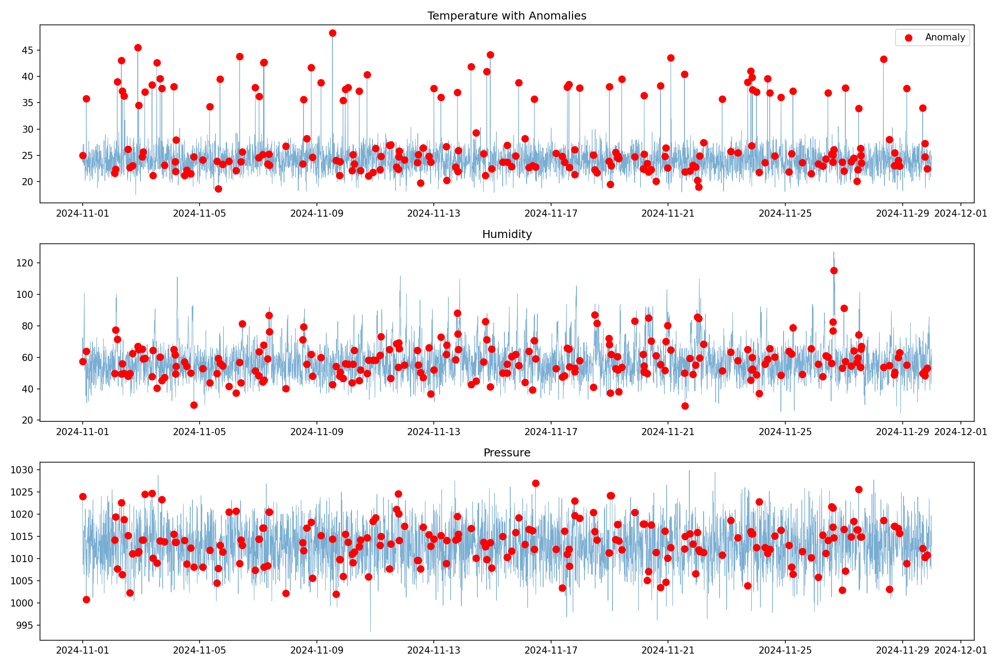
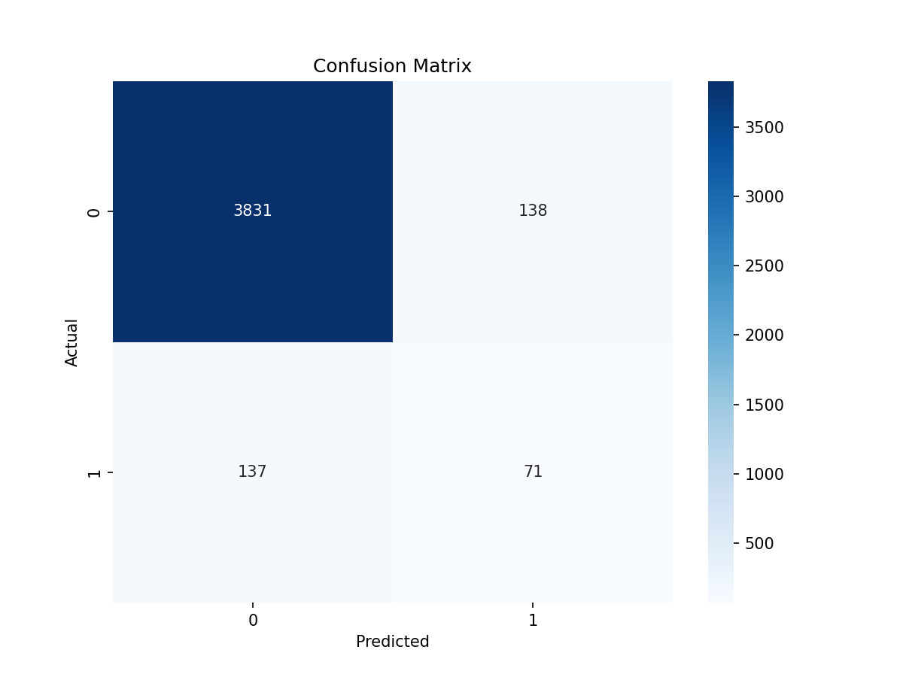
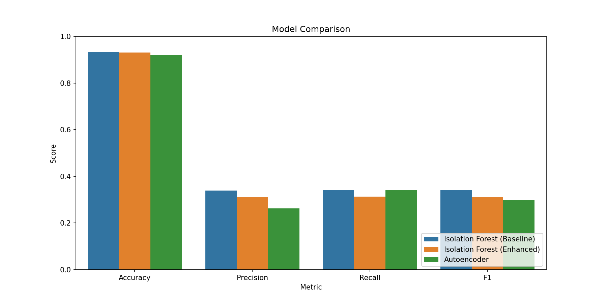

# Sensor Anomaly Detection with Machine Learning

> Intelligent system for detecting sensor failures, attacks, and outliers using ML


## 🎯 Problem

**IoT sensor networks fail silently:**
- Hardware degradation (drift, stuck values)
- Environmental interference (spikes, noise)
- Cyber attacks (data manipulation)
- Communication errors

**Impact:** False decisions, equipment damage, safety risks

**Solution:** ML-powered anomaly detection for early warning

## 💡 Approach

### Models Implemented

**1. Isolation Forest (Baseline)**
- Unsupervised learning
- Fast, efficient
- Good for outliers

**2. Isolation Forest (Enhanced)**
- Added time-based features
- Rolling statistics
- Improved accuracy

**3. Autoencoder (Neural Network)**
- Deep learning approach
- Learns normal patterns
- Detects complex anomalies

## 📊 Results

| Model | Accuracy | Precision | Recall | F1 Score |
|-------|----------|-----------|--------|----------|
| Isolation Forest (Baseline) | 0.934163 | 0.339713 | 0.341346 | 0.340528 |
| Isolation Forest (Enhanced) | 0.931290 | 0.311005 | 0.312500 | 0.311751 |
| Autoencoder | 0.919559 | 0.262963 | 0.341346 | 0.297071 |

**Best Model:** [Isolation Forest (Baseline)]

## ✨ Features

- ✅ Multiple ML algorithms (Isolation Forest, Autoencoder)
- ✅ Feature engineering (time-based, rolling stats)
- ✅ Real-time detection function
- ✅ Business impact analysis (cost-benefit)
- ✅ Feature importance analysis
- ✅ Comprehensive visualizations

## 🛠️ Tech Stack

- **Python 3.8+**
- **Scikit-learn** - Isolation Forest
- **TensorFlow/Keras** - Autoencoder
- **Pandas** - Data manipulation
- **Matplotlib/Seaborn** - Visualization

## 🚀 Installation
```bash
# Clone
git clone https://github.com/allkinn/sensor-anomaly-detection.git
cd sensor-anomaly-detection

# Install dependencies
pip install -r requirements.txt

# Generate data
python generate_data.py

# Run analysis
jupyter notebook anomaly_detection.ipynb
```

## 📖 Usage

### Quick Start
```python
from anomaly_detector import detect_anomaly_realtime

# New sensor reading
reading = {
    'temperature': 24.5,
    'humidity': 55.0,
    'pressure': 1013.0
}

# Detect
is_anomaly, score = detect_anomaly_realtime(reading)

if is_anomaly:
    print(f"ANOMALY DETECTED (score: {score:.3f})")
else:
    print(f"Normal (score: {score:.3f})")
```

### Retraining with New Data
```python
# Load new data
new_data = pd.read_csv('new_sensor_data.csv')

# Preprocess
X_new = preprocess(new_data)

# Retrain
model.fit(X_new)

# Save
import joblib
joblib.dump(model, 'model_v2.pkl')
```

## 🧪 Methodology

### Data Generation

Simulated 30 days of sensor data with injected anomalies:
- **Spikes:** Sudden value jumps
- **Drifts:** Gradual degradation
- **Stuck values:** Sensor frozen

Total: 4,177 samples, ~5% anomalies

### Anomaly Types

**Type 1: Spikes**
- Sudden temperature jump (+10-20°C)
- Detection: Isolation Forest effective

**Type 2: Drifts**
- Gradual humidity increase over time
- Detection: Rolling statistics crucial

**Type 3: Stuck Sensors**
- Same value repeated
- Detection: Std deviation features

### Evaluation Metrics

**Precision:** % of detected anomalies that are true  
**Recall:** % of actual anomalies detected  
**F1 Score:** Harmonic mean (balance)

**Business metric:** Cost savings from early detection

## 📈 Visualizations

### Data with Anomalies


### Confusion Matrix


### Model Comparison


## 💼 Business Impact

**Without Detection:**
- Cost per missed failure: $1,000
- Total annual cost: $208,000

**With ML Detection:**
- False alarm cost: $1,440
- Missed failure cost: $143,000
- **Net savings: $63,560 (30,6% ROI)**

## 🔮 Future Work

- [ ] Real-time streaming (Kafka integration)
- [ ] Multi-sensor correlation (detect coordinated attacks)
- [ ] Explainable AI (SHAP values for interpretability)
- [ ] Edge deployment (TensorFlow Lite on ESP32)
- [ ] Online learning (model adapts to new patterns)
- [ ] Alerting system (email, SMS, push notifications)

## 🎓 Learnings

**Technical:**
- Feature engineering critical for time-series
- Isolation Forest fast but simpler than neural nets
- Autoencoders powerful but require tuning
- Threshold selection impacts precision/recall tradeoff

**Domain:**
- Different anomaly types need different detection methods
- Business context matters (false alarm cost vs missed detection)
- Real-time requirements constrain model choice

## 👤 Author

**[allkinn](https://github.com/allkinn)**  
Physics Student | ML Engineer | IoT Specialist

📧 [Email] | 💼 [LinkedIn] | 🐙 [allkinn](https://github.com/allkinn/sensor-anomaly-detection.git)

## 📄 License

MIT License

---

**⭐ Star if useful | 🐛 [Report issues](https://github.com/allkinn/sensor-anomaly-detection/issues)
